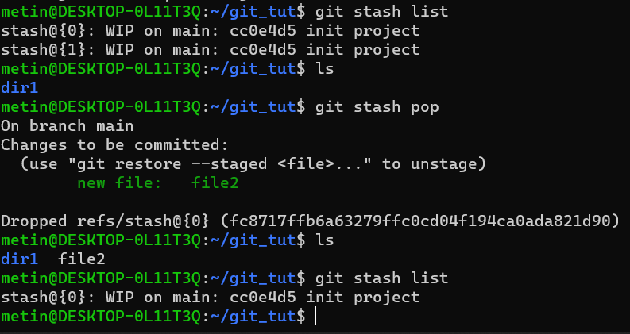
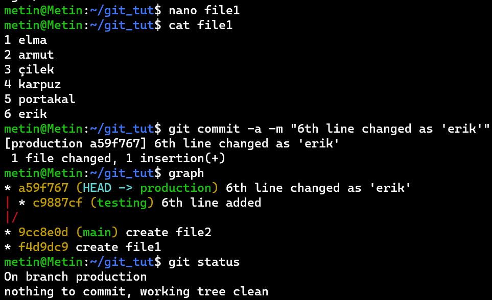

# GİT-GİTHUB
## Ders #2 
### Tekrar
---

Git, bir versiyon kontrol sistemidir. Projelerimizi versiyonlar olarak kaydetmemizi ve istediğimiz zaman bu versiyonlara dönmemize yarar. Takım çalışması gereken çalışmalarda iş bölümü planlamasını kolaylaştırır.  

Git yerel olarak çalışır. İnternet üzerinden bir veri çekmeden dosyalarınız bilgisayarınızdaki veri tabanına kaydedebilirsiniz. Bu da bize hız kazandırır.

Git bu kaydetmeleri yaparken verimli olmaya çalışır. Örneğin bir dosya üzerinde değişiklik yapmadıysanız o dosyayı yeni versiyona kopyalamak yerine dosyayı önceki versiyondan referans alır.


Git'te bir veriyi, dosyayı geri getirilemeyecek şekilde silmek zordur. (Bütünlüğü vardır.)

---

### KURULUM

- Debian: sudo apt install git
- Windows: https://github.com/git-for-windows/git/releases/download/v2.39.0.windows.2/Git-2.39.0.2-64-bit.exe
- MacOS: 
  - Terminalde git'i çalıştırınca kurulu değilse indirmeye yönlendirir.
  - brew install git
  - sudo port install git

---

### AYARLAMA

```bash
	git config --list --show-origin
```
komutu ile konfigürasyon dosyalarınızın nerede olduğunu ve içerdiklerinizi görebilirsiniz.

<u>GNU/Linux'ta:</u>

1. /etc/gitconfig dosyası: Tüm kullanıcılar için geçerli değişkenleri tutar
2. ~/.gitconfig OR ~/.config/git/config dosyası: Bir kullanıcı için özelleştirilmiş değişkenlerdir.
3. .git/config dosyası: Spesifik repo için geçerli değişkenleri tutar.

Her level bir önceki levelin üstüne yazar.

Git repositorymizi oluşturmadan önce yapılması gereken değişiklikler:

```bash
   git config --global user.name "ymozer"
   git config --global user.email yusuf.ozer@adu.edu.tr
   git config --global core.editor nano/code/...
   git config --global init.defaultBranch main   
```

---

### GIT REPOSITORY (REPO) OLUŞTURMA 

1. Herhangi bir versiyon kontrol sistemi içinde yer almayan yerel ya da dizinlerinizi Git reposuna dönüştürerek.
2. Klonlayarak 

#### Local (Yerel) Projeden Repo Oluşturma

```bash
mkdir ilk_git_repom
cd ilk_git_repom
git init
ls -la
```
Bu komutları girdiğimizde içi boş bir git reposu oluşturmuş olacağız. Eğer `ls -la` komutu ile dizinimizi görüntülersek gizli dizin olan `.git` adındaki dosyalarımızın kaydolduğu repomuzu görmüş oluruz.

#### Remote Serverlardaki Projeleri Klonlayarak Repo Oluşturma

```bash
git clone https://github.com/id-Software/DOOM.git
```

Yukardaki şekliyle `git clone` komutumuz ile Github, Gitlab gibi remote serverlarda oluşturulmuş repoları, internetimiz sistemimizde bağlı olduğu takdirde bilgisayarımıza bir git reposu şeklinde indirecektir.

Birlikte çalıştığınız proje arkadaşlarınızla birlikte verimli çalışabilmek, onların yaptıkları değişiklikleri kendi yerel çalışma alanınıza indirmek, kendi yaptığınız değişiklikleri onlarla paylaşabilmek için remote repository'lerinizi doğru ve etkin kullanmayı öğrenmeli ve yönetmelisiniz. 

Çalıştığınız firma eğer projesini git reposu üstünden yönetiyorsa size ilk verecekleri projenin Git URL'idir. Bu URL aşağıdaki şekillerde olabilir:

- ssh://user@server/git-repo.git &rarr; ssh ile kimlik doğrulama
- kullanıcıadı@sunucuadı:git-repo.git  &rarr; ssh ile kimlik doğrulama
- http://example.com/git-repo.git
- https://example.com/git-repo.git
- git://example.com/git-repo.git  &rarr; git'in kendi protokolü

---

### `.gitignore` Dosyası

Eğer bazı dosyalarımızı git reposuna kaydetmek istemiyorsak bu dosyayı kullanırız. Mesela bu dosyalar sizin üzerinizde çalıştığınız projenin kullandığı server'a giriş bilgilerinizi içeren konfigürasyon dosyalarınız olabilir. Ya da kendinize özel notlar aldığınız klasörün karşı tarafa gitmesini istemiyorsanız da kullanabilirsiniz.

 Bu dosyayı projemizin en üstünedeki konuma ekleriz.

Dosyalar ve dizinler için tek tek isimlerini yazabilirsiniz. Ancak bazı durumlarda benzer isimli veya aynı uzantılı dosyalarınız varsa kısayollar kullanabiliriz.

Kurallar:

- Boş satırlar ve # ile başlayan satırlar dikkate alınmaz.
-  *, ?, [ ], { }, [!] ve \ gibi karakterler kullanılarak oluşturulan ve *[globbing patterns](http://www.tldp.org/LDP/GNU-Linux-Tools-Summary/html/x11655.htm)* (wildcards) adı verilen tanımlayıcılar kullanabilirsiniz
- Dizinler için / (slash) karakteri kullanılır. Örneğin `/notes/hero_page/` şeklinde bir tanımlama yaptığınızda bu dizin ve içerdiği tüm dosyalar git tarafından ihmal edilir.
- ! karakteri tanımlanan bir kuralın tersini tanımlamaya yarar. Örneğin `!/notes/hero_page/` şeklinde tanım yapıldığında bu dizin hariç diğer tüm veriler ihmal edilir.

```bash
*.conf

```

---

### GIT STATES

Git Reposu içinde yer alan dosyaların 3 durumu vardır: 

1. **Modified (Değiştirilmiş):** Dosya değiştirilmiş fakat veri tabanına henüz kaydedilmemiş.
2. **Staged (Aşamalanmış):** Şuanki versiyonda değiştirilmiş dosya sonraki anlık görüntüye kaydedilmek üzere işaretlenmiş
3. **Commited (Kaydedilmiş):** Veri başarılı ve güvenli şekilde yerel veri tabanında depolandı


Commit'lenmemiş yani henüz repomuza kaydolmamış dosyalar hangi aşamada olduğunu görebilmemiz için `git status` komutunu kullanırız. Bu komut bize 3 grupta yer alan dosyaları listeler:

- **STAGED - Changes to be committed (Commit edilmeye hazır dosyalar):** Bu gruptaki dosyalar **git add** veya **git rm** komutu ile Staging Area'ya eklediğimiz dosyalardır. Bu dosyalar bir sonraki commit'imizin içinde yer alacaktır
- **Changes not staged for commit (Commit için henüz hazır olmayan dosyalar):** Bu gruptaki dosyalar değişiklik yaptığımız fakat henüz Staging Area'ya eklemediğimiz dosyalardır. Bu dosyalar bir önceki grubun içine eklemediğimiz sürece bir sonraki commit'e dahil olmayacaklarıdır.
- **Untracked files (Versiyon takibinde olmayan dosyalar):** Bu gruptaki dosyalar ise henüz versiyon kontrolü altına almadığımız dosyalardır.

####  `git add ve git rm` Komutları

Dosyalarımız Stage'lemek için git add komutunu kullanırız ve bu bize bu dosyanın commite hazır olduğunu belirtir.

```bash
git add .				#--> Bulunulan dizinin içindeki tüm dosyaları stagelemeye yarar.
git style.css /images	 #--> Tek tek dosyaları-dizinleri gösterildiği gibi stageleyebiliriz.
git add *.jsx			#--> Wildcard kullanımı ile kullanımı ile stageleyebiliriz.
```

 Dosyaların bir sonraki committe yer almayacağını belirtmek için `git rm` komutunu kullanırız.

```bash
git rm main.py
```

---

### DEĞİŞİKLİKLERİ COMMİT'LEMEK

Değişiklerimizi  `git add ve git rm` komutları ile "Staging Area"ya aldıktan sonra `git commit` komutu ile yeni versiyon olarak kaydedebiliriz. 

```
git commit -m "main.py dosyası içerisindeki print() ifadeleri düzeltildi."
```

-m parametresini text editörünü açmadan terminalde tek satır, kısaca mesajımızı girmek için kullandık. Eğer daha uzun açıklamalar yazıcaksanız bu parametreyi kaldırmanız yeterlidir.

Evet, bir mesaj yazmanız zorunlu.

 <u>**NOT:**</u> Bu yazdığımız commit mesajları yaptığımız değişiklikleri <u>bilgilendirici</u> şekilde yazılmalı ki hem çalışma grubunuzdaki diğer kişiler anlayabilsin hem de siz sonradan döndüğünüzde neden böyle değişiklik yaptığınız daha hızlı ve rahat anlaşılabilsin. 

---

#### İYİ BİR COMMİT 

Yaptığımız değişiklikler farklı konularda ise her konu için mümkünse farklı commit yapmalı ve commit mesajımızı ona göre yazmalıyız. 

Eğer değiştirdiğimiz şeyler tamamlanmamış değilse yani bir bütünlüğü YA DA test edilmemişse yoksa commit yapmamaya dikkat etmelisiniz. Eğer arada bir yaptıklarınızı kayıt etmek istiyorsanız `git stash` komutunu kullanabilirsiniz:


- `git stash pop` komutu listenin en üstündeki değişikliği projemize ekler ve bu değişikliği stash listesinden siler.

  

- `git stash apply` komutu istenilen değişikliği projemize ekler ama silmez. 

  

- `git stash drop` komutu değişiliği listeden silmemize yarar.


Commit mesajınızdaki açıklamalar kısa ve öz olmalı.

---

Eğer commitlerimizin geçmişini ve değiştirdiğimiz kısımları görmek istiyorsak  `git log` komutunu kullanıyoruz.  `git log` komutu tek başına çalıştırıldığında: 

- Commit'in Hash değeri
- Commit'i gerçekleştiren kişinin adı ve maili
- Commit tarihi
- Commit mesajını içerir.

Eğer commit içeriklerini görmek istiyorsak -p parametresi detaylı bir şekilde bunları listeleir.

---

## Bu Haftanın Konusu: Branching

Git'te her repo farkında olmasanız bile bir branch (dal) altındadır. Örneğin: Dersin başında config olarak eklediğimiz **main** branch'ını belirttiğimiz komut bize sonraki repo oluşturduğumuzda main isimli branchı kullancağımızı belirtti. Ancak git varsayılan olarak **master** adlı branch'ı oluşturur.

Branchler bize aynı dosyanın farklı versiyonu ile paralel çalışmamızı sağlar. daha sonra bu farklı versiyonları devam ettirebilir ya da üstündeki değişiklikleri birleştirebiliriz. 

Branchlerin bu özelliği her branchi farklı  amaçlar için kullanmamıza  olanak tanır. Örneğin geliştirme için ayrı bir branchimiz ve yayınlanan sürüm için ayrı sürümümüz olabilir.


yukarıda gözüktüğü gibi, her commit yaptığımızda bulunduğumuz branch pointerı en son commitimize ilerler. 

HEAD pointerı bizim hangi branch üzerinde çalıştığımızı belirten özel bir pointerdır. Sembolik pointer olarak da adlanırıllabilir.

Git log komutuna aşağıdaki gibi parametreleri ekleyerek commit grafiğini görüntüleyebiliriz.


Bu yukarıdaki komutu ders sırasında çokça kullanacağımızdan kısayol ekleyelim:


Şimdi main branchımız yanında farklı branchlar da ekleyelim.

___

### YENİ BRANCH OLUŞTURMA 

`git branch [BRANCH_NAME]` ile yeni bir branch oluşturabiliriz. Bu komut, HEAD pointerı nerede konumlandıysa orada branchlarımızı oluşturur. Tek başına `git branch` kullanımı diğer branchları listeler ve hangi branch üstünde çalıştığımızı gösterir. -v seçeneği ile detaylı listeleme yapılabilir.


`git checkout` komutu ile üzerinde çalıştığımızı branchı değiştirebiliriz. Bu da HEAD pointerının belirttiğimiz branchı pointlemesine yol açar. Şimdi bu branchları checkout yapalım ve onlar üstünde commitlerimizi yapalım. 




---

### MERGE'ing (Birleştirme)

#### Fast-forward merge

main branch ile production branchını mergelemek istiyoruz. Bunun için `git merge` komutunu kullanıyoruz.


--merged seçeneği birleşen branchları listeler:

Şimdi bu 2 branch mergelendiği ve aynı içerikte olduğu için production'ı silebiliriz.

---

#### 3 WAY MERGE 

Bu merge 3 tane commite bakarak merge'ü gerçekleştirdiğinden bu adı almıştır. 


Yukarıda 3 way merge'ü yapmaya çalıştık fakat başarılı olmadı çünkü aynı dosyadaki aynı satırı değiştirdiğimizden  CONFLICT oluştu.  Şimdi bunları nasıl gidereceğimize bakalım.

___

#### MERGE CONFLICTS

Eğer confilict içeren bir merge yapmaya çalışırsak git bizim için confilictin nerede olduğunu aşağıdaki gibi işaretliyor:4

Aşağıdaki gibi conflictlerden birini seçerek dosyamızı düzenlediğimizde sorun düzelecektir:


Sonrasında testing branchimizi silebiliriz:


